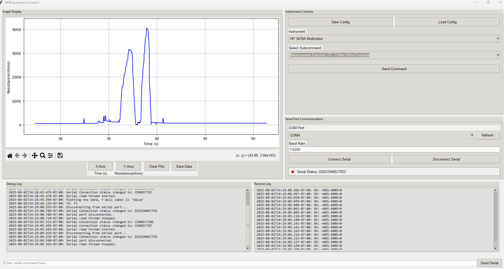

# USB-GPIB Instrument Controller

This project provides a graphical user interface (GUI) built with Python's Tkinter library for controlling various laboratory instruments, including those that use GPIB communication via a Prologix USB-to-GPIB adapter connected over a serial (COM) port. It allows users to select a variety of instruments, send specific commands, and log measurement data. 

## Current Features

The application offers a robust set of functionalities designed for efficient instrument interaction and data monitoring:

### 1. Instrument Control

* **Instrument Selection:** Easily choose from a predefined list of supported instruments.

* **Subcommands:** The available subcommands and their associated parameters update based on the selected instrument.

* **Supported Instruments and Commands:**

 ### HP 3478A Multimeter

* **Preset Commands**
    * **Home Command** (`H0`): Resets the multimeter to default settings.
    * **Measure DC Voltage** (`H1`)
    * **Measure AC Volts** (`H2`)
    * **Measure 2-Wire Ohms** (`H3`)
    * **Measure 4-Wire Ohms** (`H4`)
    * **Measure DC Current** (`H5`)
    * **Measure AC Current** (`H6`)
    * **Measure Extended Ohms** (`H7`)

* **Measurement Function Commands**
    * **DC Volts Function** (`F1`)
    * **AC Volts Function** (`F2`)
    * **2-Wire Ohms Function** (`F3`)
    * **4-Wire Ohms Function** (`F4`)
    * **DC Current Function** (`F5`)
    * **AC Current Function** (`F6`)
    * **Extended Ohms Function** (`F7`)

* **Range Commands**
    * **30mV DC Range** (`R-1`)
    * **300mV/300mA Range** (`R-2`)
    * **3V AC or DC/3A AC or DC Range** (`R0`)
    * **30V AC or DC/30 ohm Range** (`R1`)
    * **300V DC or AC/300 ohm Range** (`R2`)
    * **3K ohm Range** (`R3`)
    * **30K ohm Range** (`R4`)
    * **300K ohm Range** (`R5`)
    * **3M ohm Range** (`R6`)
    * **30M ohm Range** (`R7`)
    * **Autoranging** (`RA`)

* **Display Commands**
    * **Return to Normal Display** (`D1`)
    * **Write to Display** (`D2{text}`): Sends a custom text string to the display.
    * **Write to Display (30ms)** (`D3{text}`): Sends a custom text string to the display for 30ms.
    * **3 1/2 Digit Display** (`N3`)
    * **4 1/2 Digit Display** (`N4`)
    * **5 1/2 Digit Display** (`N5`)

* **Trigger Commands**
    * **Internal Trigger** (`T1`)
    * **External Trigger** (`T2`)
    * **Single Trigger** (`T3`)
    * **Trigger Hold** (`T4`)
    * **Fast Trigger** (`T5`)

* **Autozero Commands**
    * **Autozero off** (`Z0`)
    * **Autozero on** (`Z1`)

* **Other Commands**
    * **Read Binary Status** (`B`)
    * **Read Error Register** (`E`)
    * **Clear Serial Poll Register** (`K`)
    * **Set SRQ Mask** (`M{mask}`): Sets the SRQ mask using a 2-digit hex value.
    * **Return Front/Rear Switch Position** (`S`)
    * **Calibrate** (`C`)

  #### Power Supply (WIP)

  * **Set Voltage**

  * **Set Current Limit**

  * **Output ON/OFF**

  * **Measure Output**

  #### Chroma DC Load (WIP)

  * **Set Current**

  * **Set Voltage**

  * **Load ON/OFF**

  * **Measure Input**

### 2. Serial Communication

* **COM Port Management:**

  * Detects and lists all available COM ports on your system.

  * Displays COM port availability and offers customizable configuration of the baud rate.

  * Includes a visual status indicator (red/green light).

* **Command Sending:**

  * Effortlessly send commands generated via the instrument controls.

  * Utilize a dedicated input bar to send arbitrary, custom serial commands.

* **Real-time Logging:**

  * A "Debug Log" captures detailed application events and sent commands in real-time. It also provides an interface for testing ASCII input via the COM port.

  * A "Receive Log" displays incoming data from the serial port as an output.

  * Both logs feature intelligent **auto-scrolling** that automatically pauses when you manually scroll up, allowing uninterrupted review of historical data while handling new packets.

### 3. Data Visualization (Plotting)

* **Real-time Plotting (WIP):** Integrates the Matplotlib library to display live measurement data over time.

* **Supported Plotting Modes (In Progress):** Automatically plots data received for key measurements from the **HP 3478A Multimeter**.

* **Dynamic Labels (In Progress):** The Y-axis label and plot title dynamically update to reflect the specific type of measurement being visualized.

* **Dynamic Axis Scaling (In Progress):** Plot axes automatically adjust to accommodate incoming data ranges, ensuring optimal visibility.

* **Clear Plot (In Progress):** A convenient button to instantly clear all plotted data and reset the graph for a new session.

### 4. User Interface (GUI)

* **Intuitive Layout:** The application features a well-organized and user-friendly interface with distinct sections for instrument controls, serial communication, and data logs/plots.

* **Configuration Management (WIP):** "Save Config" and "Load Config" buttons are present, allowing users to save and load instrument, subcommand, parameter, and serial settings to and from a JSON file.

## Features To Be Added

* **Multiple Instrument Functionality:** Support simultaneous data logging from multiple instruments, including both district models and multiple units of the same model.

* **Data Export:** Add options to easily export received raw data and generated plot data to common formats like CSV, for further analysis.

* **Advanced Plotting Features:**

  * Support for plotting data from multiple measurement channels simultaneously on the same graph.

  * Customizable plots, including colors, line styles, and markers for data from several instruments.

  * Enhanced interactive tools for zooming, panning, and detailed data inspection beyond the default Matplotlib toolbar.

* **Input Validation:** Implement more robust validation for all user inputs, ensuring data integrity and preventing common errors (e.g., ensuring numeric values where expected).

* **Error Handling Improvements:** Expand error reporting with more specific details and more robustness to the addition of other instruments and subcommands.

* **User Preferences (WIP):** Allow users to save and load application preferences such as data logging settings, display settings, and default COM port settings.